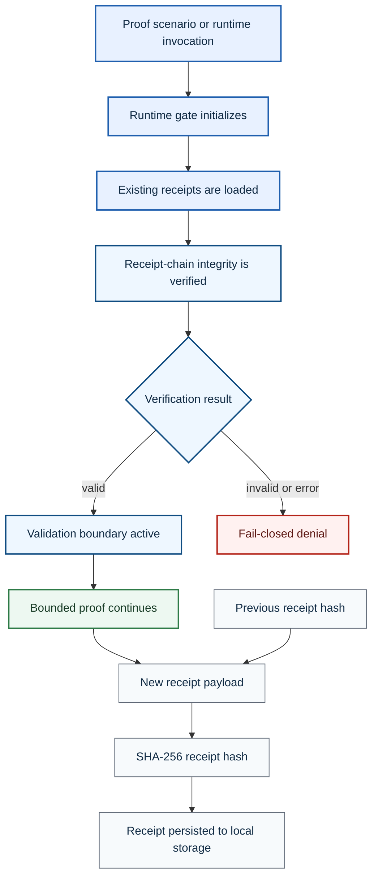

# DETERMA Micro Runtime


**Minimal Node.js proof of a fail-closed runtime gate and chained decision receipts.**

This repository isolates a small set of runtime-governance mechanics so they can be inspected and exercised without the complexity of a full platform.

## Repository Boundary

| Dimension | Classification |
|---|---|
| Repository role | Minimal runtime proof |
| Runtime | Local Node.js scripts |
| Decision effect | Local process exit and proof behavior |
| External execution | Not implemented |
| Production readiness claim | None |

## Runtime Architecture



## Implemented Components

| Path or command | Purpose |
|---|---|
| `factory/runtime_gate.js` | Initializes the gate, verifies receipts and denies on error |
| `factory/receipt_writer.js` | Creates a locally persisted SHA-256-linked receipt |
| `npm run proof` | Runs the primary proof scenario |
| `npm run proof:rollback` | Exercises rollback-oriented proof behavior |
| `npm run proof:replay` | Exercises replay-oriented proof behavior |
| `npm run verify:receipts` | Verifies persisted receipt continuity |
| `npm run runtime:gate` | Runs the fail-closed validation boundary |
| `npm run receipt:write` | Persists a new chained receipt |

## Quickstart

```bash
npm install
npm run proof
npm run verify:receipts
npm run runtime:gate
```

## Design Principles Demonstrated

- validation occurs before bounded continuation;
- verification failure terminates the process with a denial;
- receipts link to the prior receipt hash;
- evidence is persisted separately from the proposed action;
- the proof favors explicit denial over silent continuation.

## Truth Boundary

This repository is intentionally minimal. It does **not** establish:

- enterprise-grade append-only storage;
- a production executor;
- complete mediation of external actions;
- customer deployment or validation;
- production identity, networking, availability or key-management controls;
- a full DETERMA Runtime Authority implementation.

## Core Statement

**The micro runtime demonstrates the shape of a fail-closed gate and a verifiable receipt chain; it is not a production control plane.**
