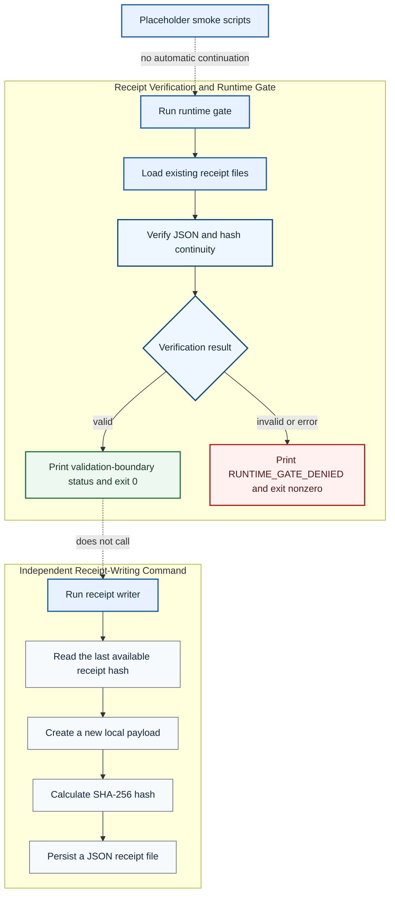

# DETERMA Micro Runtime


**Minimal Node.js implementation candidate for receipt verification, a fail-closed process boundary and locally chained receipt files.**

This repository isolates a small set of runtime-governance mechanics. Several scripts are placeholders or smoke outputs rather than executable proofs, and the committed receipt fixtures currently exercise failure conditions rather than a clean success path.

## Repository Boundary

| Dimension | Classification |
|---|---|
| Repository role | Minimal implementation candidate and local smoke surface |
| Runtime | Local Node.js scripts |
| Decision effect | Local process exit only |
| External execution | Not implemented |
| Production readiness claim | None |

## Current Component Topology

The gate and receipt writer are separate commands. A successful gate invocation does not automatically execute a proof scenario or persist a new receipt.



## Implemented Components

| Path or command | Current behavior |
|---|---|
| `factory/runtime_gate.js` | Runs `verify:receipts`; prints an active boundary only when verification exits successfully; otherwise fails closed |
| `factory/receipt_writer.js` | Independently creates a local SHA-256-linked receipt file |
| `npm run verify:receipts` | Parses and verifies committed receipt files |
| `npm run runtime:gate` | Wraps receipt verification in a fail-closed process boundary |
| `npm run receipt:write` | Runs the independent receipt writer |
| `npm run proof` | Placeholder/smoke script; it does not validate governed execution |
| `npm run proof:rollback` | Placeholder/smoke script; it does not exercise rollback enforcement |
| `npm run proof:replay` | Placeholder/smoke script; it does not exercise replay enforcement |

## Clean-Checkout Reality

At the current repository state, the committed receipt directory contains malformed or intentionally inconsistent fixtures. Therefore:

```bash
npm install
npm run verify:receipts
```

is currently expected to exit nonzero rather than demonstrate a successful chain. `npm run runtime:gate` consequently demonstrates fail-closed denial on that state.

The following command writes a new receipt independently:

```bash
npm run receipt:write
```

It does not automatically repair malformed historical files, execute a mutation or prove end-to-end authority behavior.

## Safe Evaluation Commands

```bash
npm install
npm run proof              # smoke output only
npm run verify:receipts    # inspect current verification failure
npm run runtime:gate       # observe fail-closed process behavior
npm run receipt:write      # independent local receipt write
```

## Properties Actually Demonstrated

- receipt verification can terminate with a nonzero result;
- the runtime-gate wrapper fails closed when verification throws or exits nonzero;
- the receipt writer links a newly created payload to the last available receipt hash;
- gate execution and receipt creation are separate operations;
- placeholder scripts must not be treated as proof evidence.

## Truth Boundary

This repository does **not** establish:

- a clean-checkout successful verification path in its current fixture state;
- executable replay or rollback proofs from the placeholder scripts;
- automatic evidence issuance after a gate result;
- enterprise-grade append-only storage;
- a production executor or complete mediation of external actions;
- customer deployment or validation;
- production identity, networking, availability or key-management controls;
- a full DETERMA Runtime Authority implementation.

## Core Statement

**The micro runtime contains inspectable local components and a fail-closed verification wrapper; it is not an end-to-end governed-execution proof or a production control plane.**
